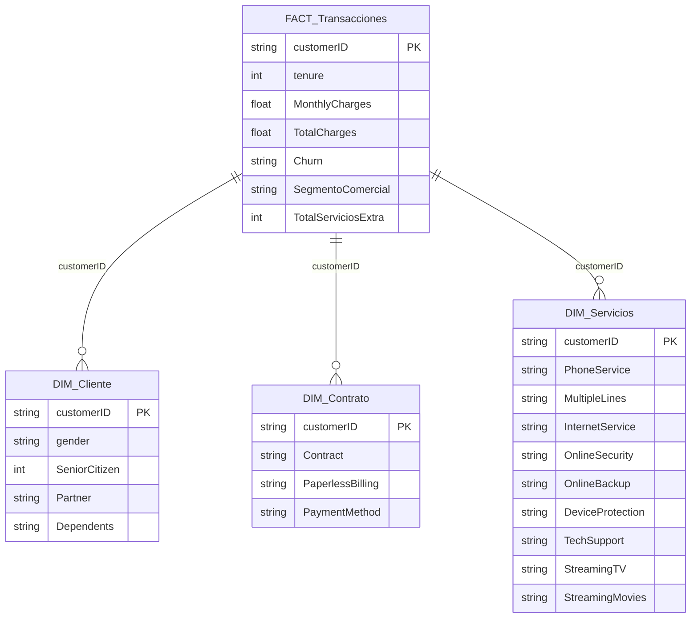

# ⚙️ Fase 2: Transformación y Modelado Relacional (Star Schema)

Para optimizar el rendimiento en Power BI y asegurar la escalabilidad del proyecto, se descartó el uso de la tabla plana original (`Telco-Customer-Churn`). En su lugar, el procesamiento de la base de datos se establecerá en un **Modelo Estrella** mediante Vistas (`VIEW`) en SQL Server.

### 📐 Arquitectura del Modelo
Se normalizó la base de datos en una tabla de hechos central y tres dimensiones, relacionadas a través de la clave primaria `customerID`:



### 🧠 Ingeniería de Características (Feature Engineering)
Se generaron nuevas columnas dentro de la vista creada de `vw_Fact_Transacciones` para inyectar valor comercial directo sin alterar los datos crudos:

* **Segmento Comercial [`SegmentoComercial`]**: Clasificación automática mediante `CASE WHEN` (*Riesgo Fuga*, *Upselling* o *Cross-selling*) basada en los umbrales críticos detectados en el EDA.
* **Índice de Retención / Stickiness [`TotalServiciosExtra`]**: Sumatoria de los servicios de valor agregado (`TechSupport`, `OnlineSecurity`, `DeviceProtection`, `OnlineBackup`) para obtener una métrica de 0 a 4 que permita medir la barrera de salida o nivel de anclaje de cada cliente.

---

### 💻 Código SQL de Implementación

<details>
<summary>👉 Ver script de creación de Vistas (ETL y Dimensiones)</summary>

```sql
USE TelcoDB;
GO

-- 1. DIMENSIÓN CLIENTE
CREATE VIEW vw_Dim_Cliente AS
SELECT customerID, gender, SeniorCitizen, Partner, Dependents
FROM [Telco-Customer-Churn];
GO

-- 2. DIMENSIÓN SERVICIOS
CREATE VIEW vw_Dim_Servicios AS
SELECT customerID, PhoneService, MultipleLines, InternetService, OnlineSecurity, OnlineBackup, DeviceProtection, TechSupport, StreamingTV, StreamingMovies
FROM [Telco-Customer-Churn];
GO

-- 3. DIMENSIÓN CONTRATO
CREATE VIEW vw_Dim_Contrato AS
SELECT customerID, Contract, PaperlessBilling, PaymentMethod
FROM [Telco-Customer-Churn];
GO

-- 4. TABLA DE HECHOS (Feature Engineering)
CREATE VIEW vw_Fact_Transacciones AS
SELECT 
    customerID,
    tenure,
    MonthlyCharges,
    TRY_CONVERT(FLOAT, NULLIF(TotalCharges, ' ')) AS TotalCharges,
    Churn,
    CASE 
        WHEN Contract = 'Month-to-month' AND MonthlyCharges > 70 THEN 'Grupo 1 (Riesgo Fuga)'
        WHEN Churn = 'No' AND InternetService = 'DSL' AND tenure > 24 THEN 'Grupo 2 (Upselling)'
        WHEN Churn = 'No' AND PhoneService = 'Yes' AND InternetService = 'No' AND tenure > 12 THEN 'Grupo 3 (Cross-selling)'
        ELSE 'Estable / Sin clasificar'
    END AS SegmentoComercial,
    (CASE WHEN OnlineSecurity = 'Yes' THEN 1 ELSE 0 END +
     CASE WHEN OnlineBackup = 'Yes' THEN 1 ELSE 0 END +
     CASE WHEN DeviceProtection = 'Yes' THEN 1 ELSE 0 END +
     CASE WHEN TechSupport = 'Yes' THEN 1 ELSE 0 END) AS TotalServiciosExtra
FROM [Telco-Customer-Churn];
GO
```
</details>
